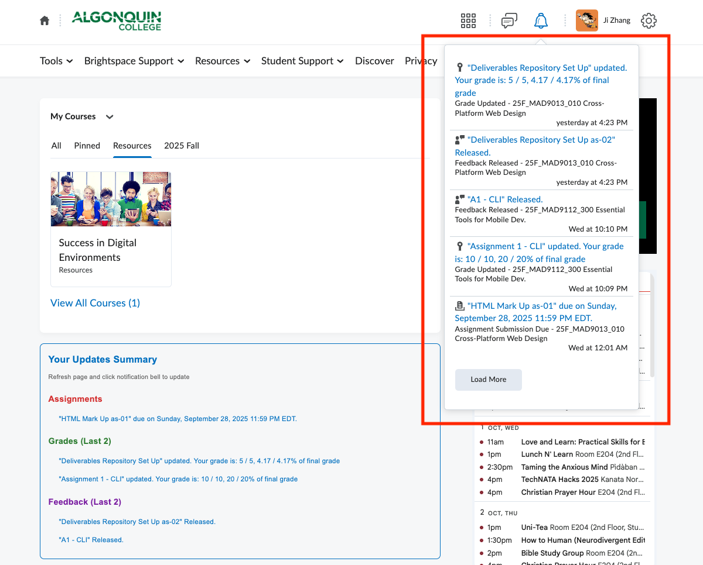
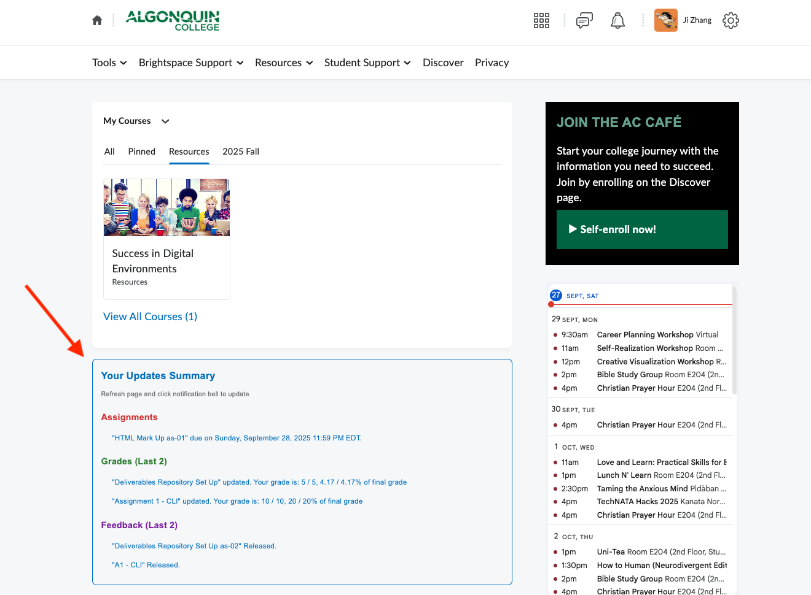

# Brightspace Assignment Tracker

This is a javascript code for display the assignment information in the Brightspace home page: https://brightspace.algonquincollege.com/d2l/home

We already have those data, we can check the information by click the right up corner Bell:

It is better to display the due soon item in the page for remind like this:

## Tampermonkey

It is using [Tampermonkey](https://chromewebstore.google.com/detail/dhdgffkkebhmkfjojejmpbldmpobfkfo?utm_source=item-share-cb) to help manage the script deployment. We can check the Tampermonkey detail in the website: https://www.tampermonkey.net/

## know issue
The data has to be load by manually click the right up corner Bell button, since there are some "Shadow DOM" which cannot been catched by javascript in the page.

## function
1. We only display the coming up due item, passed due items will not show in the data.
2. We only display two last Grades and Feed back items.
3. The data was saved in the explorer localStorage.
4. The script only been tested in Chrome env.